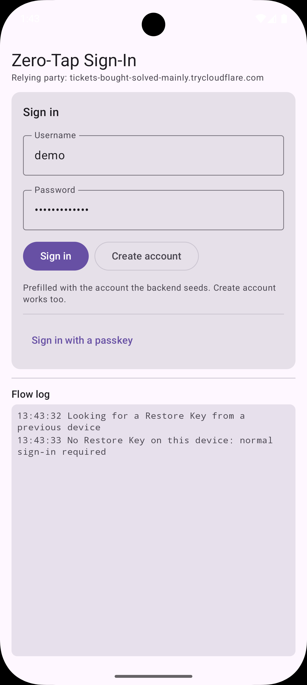
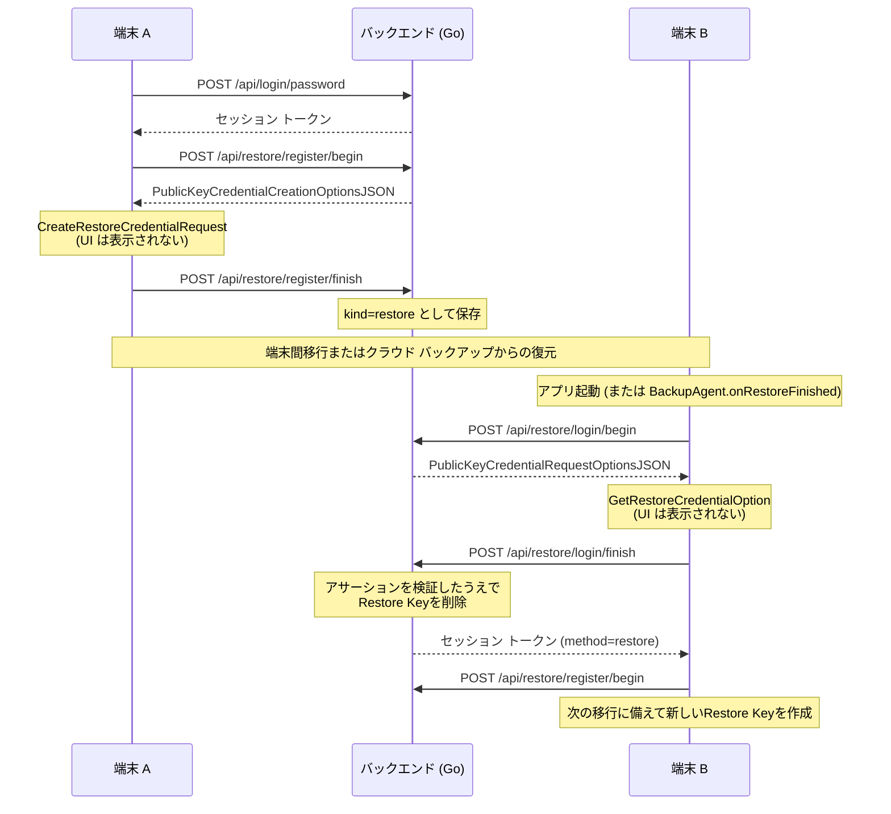

# Zero-Tap サインイン デモ

*[English](README.md) | 日本語*

Android の [Restore Credentials API](https://developer.android.com/identity/sign-in/restore-credentials)
を使って、**端末移行をまたいだZero-Tap サインイン**を実際に動かすデモです。

| 方式 | ユーザー操作 |
| --- | --- |
| パスワード | ユーザー名とパスワードを入力 |
| Passkey | 生体認証 / 画面ロックのプロンプト |
| **Restore Key** | **なし** |

シナリオ:

1. 端末 A でサインインする (パスワードまたはPasskey)。
2. アプリが**Restore Key**を background で登録
3. 端末 A から端末 B へ移行
4. 端末 B でアプリを開と、ユーザーの確認なしでサインイン済みになる
  - このときサーバーは使ったRestore Keyを失効させ、アプリはすぐ新しいキーを発行し直すこと

| インストール直後 | パスワードでサインインした後 | Restore Key による Zero-Tap Sign-In |
| --- | --- | --- |
|  |  | <video src="assets/zero-tap-sign-in-from-backup.mp4" width="320" /> |
| この端末に Restore Key がないので通常のサインイン | プロンプトなしで Restore Key を登録済み、サーバーも保持している | ユーザー操作なしでサインインが完了する |

## 仕組み



- Restore Keyは普通の WebAuthn クレデンシャルで、Passkeyと同じ FIDO ライブラリで検証できる
- 違いは 2 点
  - **ユーザー操作がない**
    - Zero-Tapのアサーションは User Present フラグも User Verified フラグも持たないため、
    [`backend/webauthn.go`](backend/webauthn.go) の復元パスはこれらを要求しない
    - Passkeyのパスでは引き続き両方を要求する
  - **使い捨て**
    - `POST /api/restore/login/finish` のように、成功時にクレデンシャルを削除することでバックアップを再度復元しても動作しないようにすうr

## リポジトリ構成

```
backend/                  Go サーバー: パスワード認証、Passkey、Restore Key、Digital Asset Links
android/                  Kotlin アプリ: Jetpack Compose UI、Credential Manager、BackupAgent
android/debug.keystore    リポジトリに含めた署名鍵 (証明書が固定 → デフォルトの fingerprint がそのまま使える)
scripts/                  バックアップ テストに必要な 2 台のエミュレーターを作成する
docs/                     移行のテスト手順
```

## 前提

- Go 1.24 以降
- JDK 17 以降と Android SDK
  - 一部スクリプトでは `ANDROID_HOME` が設定されていることを要求
- Android Studio Otter (2025.2.1) 以降
  - バックアップ / 復元ツールが搭載されているため。プロジェクトのAGPをあげろという意味ではない
- Android 9 以降の実機 2 台、または **Google Play** システム イメージ (`google_apis_playstore`) の
  エミュレーター 2 台で、Google Play services 24220000 以降
  - [エミュレーターのセットアップ](docs/emulator-setup.ja.md)を参照
- 公開 HTTPS ホスト名を用意できるトンネル (`ngrok`、`cloudflared` など)。
  - Credential Manager は [Digital Asset Links](https://developers.google.com/digital-asset-links) を HTTPS 経由でしか検証できないため

## セットアップ

### 1. トンネルを起動する

```console
$ ngrok http 8080
# または: cloudflared tunnel --url http://localhost:8080
```

### 2. バックエンドを起動する

```console
$ cd backend
$ RP_ID=abc123.ngrok-free.app go run .
$ curl https://abc123.ngrok-free.app/.well-known/assetlinks.json # HTTPS で到達できることを確認
```

### 3. アプリをインストールする

`zerotap.rpId` はトンネルのホスト名と一致させること

```console
$ cd android
$ ./gradlew installDebug -Pzerotap.rpId=abc123.ngrok-free.app
```

> バックエンドは `demo` / `demo-password` を初期投入し、アプリはそれをあらかじめ入力しているので **サインイン**はそのまま動く

### 4. 端末を移行する

- **[端末間 (Device to Device) バックアップ](docs/device-to-device-backup-test.ja.md)**
  — Android Studio が片方の端末をバックアップし、もう一方で復元

  ```console
  $ cd android && ./gradlew createDemoAvds     # zerotap-a と zerotap-b
  ```

- **[実機での移行](docs/device-migration-test.ja.md)** — 実機 2 台と初期化が必要。
  `BackupAgent.onRestoreFinished()` を本来の文脈で動かせる唯一の経路です。

## 設定

### バックエンド (環境変数)

| 変数 | デフォルト | 意味 |
| --- | --- | --- |
| `ADDR` | `:8080` | 待ち受けアドレス |
| `DB_PATH` | `zerotap.db` | SQLite のデータベース ファイル。空にするとインメモリ |
| `RP_ID` | `localhost` | WebAuthn の Relying Party ID。アプリが通信するホスト名と一致させる |
| `RP_NAME` | `Zero-Tap Sign-In Demo` | クレデンシャル UI に表示される名前 |
| `ANDROID_PACKAGE_NAME` | `com.github.jmatsu.zerotap` | asset links ステートメントに載せるパッケージ名 |
| `ANDROID_CERT_FINGERPRINTS` | `android/debug.keystore` の fingerprint | 署名証明書の SHA-256 (コロン区切り 16 進、カンマ区切り)。ここから `android:apk-key-hash:` オリジンを導出する |
| `EXTRA_ORIGINS` | *(空)* | 追加で許可する `clientDataJSON` のオリジン |
| `RESTORE_REQUIRE_USER_PRESENCE` | `false` | `true` にすると復元アサーションにも User Present フラグを要求する |
| `SEED_DEMO_USER` | `demo:demo-password` | 起動時に作成するアカウント。`off`、`none`、`-` で無効化 |

### アプリ (Gradle プロパティ)

| プロパティ | デフォルト | 意味 |
| --- | --- | --- |
| `zerotap.rpId` | `localhost` | Relying Party ID 兼、アプリが呼ぶ `https://<rpId>` のホスト |
| `zerotap.demoUsername` | `demo` | サインイン フォームの初期値。`SEED_DEMO_USER` と揃えること |
| `zerotap.demoPassword` | `demo-password` | サインイン フォームの初期値。両方を空にすると空欄で表示される |

## API

| エンドポイント | 認証 | 用途 |
| --- | --- | --- |
| `POST /api/signup` | — | アカウント作成 |
| `POST /api/login/password` | — | パスワード サインイン |
| `GET /api/me` | Bearer | アカウントとクレデンシャルの概要 |
| `POST /api/logout` | Bearer | セッションを破棄 |
| `POST /api/passkey/register/{begin,finish}` | Bearer | Passkeyの登録 |
| `POST /api/passkey/login/{begin,finish}` | — | Discoverable なPasskey サインイン |
| `POST /api/restore/register/{begin,finish}` | Bearer | Restore Keyの登録 |
| `POST /api/restore/login/{begin,finish}` | — | **Zero-Tap サインイン。キーを失効させる** |
| `POST /api/restore/revoke` | Bearer | サインアウト時にRestore Keyを破棄 |
| `GET /.well-known/assetlinks.json` | — | Digital Asset Links ステートメント |

- `begin` は `{"ceremonyId", "requestJson"}` を返し、`requestJson` はそのまま Credential Manager に渡せる形式(WebAuthn のオプション オブジェクト)
- `finish` は `{"ceremonyId", "credential"}` を受け取る
  - `credential` は Credential Manager が生成したレスポンス JSON
