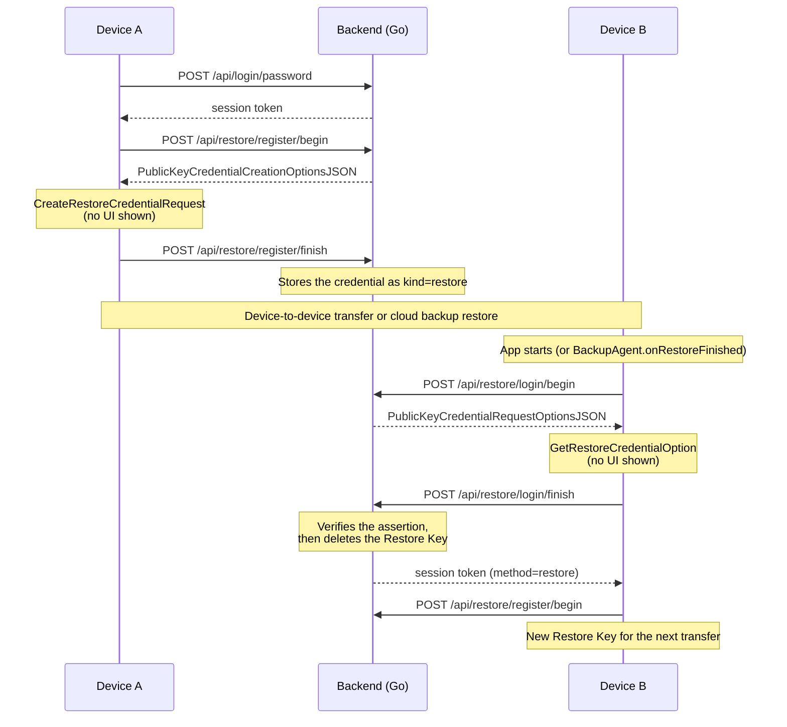

# Zero-Tap Sign-In demo

*English | [日本語](README.ja.md)*

A working demo of **Zero-Tap Sign-In across a device transfer**, built on the Android
[Restore Credentials API](https://developer.android.com/identity/sign-in/restore-credentials).

| Method | User interaction |
| --- | --- |
| Password | Types username and password |
| Passkey | Biometric / screen-lock prompt |
| **Restore Key** | **None** |

Scenario:

1. Sign in on device A (password or passkey).
2. The app registers a **Restore Key** in the background.
3. Transfer device A to device B.
4. Open the app on device B: already signed in, with no user confirmation.
  - The server revokes the redeemed Restore Key, and the app immediately registers a fresh one.

| Fresh install | After a password sign-in | On restore |
| --- | --- | --- |
|  |  | <video src="assets/zero-tap-sign-in-from-backup.mp4" width="320" /> |
| No Restore Key on this device, so an ordinary sign-in | The app registered a Restore Key with no prompt, and the server holds it | Sign-in completes w/o user interaction from a Restore Key. |

## How it works



- A Restore Key is an ordinary WebAuthn credential, verifiable with the same FIDO library as a passkey
- Two differences
  - **No user gesture**
    - A zero-tap assertion carries neither the User Present nor the User Verified flag, so the restore
    path in [`backend/webauthn.go`](backend/webauthn.go) does not require them
    - The passkey path still requires both
  - **Single use**
    - `POST /api/restore/login/finish` deletes the credential on success, so restoring the same backup
    again does not work

## Repository layout

```
backend/                  Go server: password auth, passkeys, Restore Keys, Digital Asset Links
android/                  Kotlin app: Jetpack Compose UI, Credential Manager, BackupAgent
android/debug.keystore    Checked-in signing key (fixed certificate → the default fingerprint just works)
scripts/                  Creates the two emulators the backup test needs
docs/                     How to test the transfer
```

## Prerequisites

- Go 1.24+
- JDK 17+ and the Android SDK
  - Some scripts require `ANDROID_HOME` to be set
- Android Studio Otter (2025.2.1) or newer
  - For its backup/restore tooling. It does not mean bumping the project's AGP
- Two Android 9+ devices, or two emulators on a **Google Play** system image (`google_apis_playstore`)
  with Google Play services 24220000+
  - See [emulator setup](docs/emulator-setup.md)
- A tunnel giving a public HTTPS hostname (`ngrok`, `cloudflared`, …)
  - Credential Manager can only verify [Digital Asset Links](https://developers.google.com/digital-asset-links)
  over HTTPS

## Setup

### 1. Start a tunnel

```console
$ ngrok http 8080
# or: cloudflared tunnel --url http://localhost:8080
```

### 2. Run the backend

```console
$ cd backend
$ RP_ID=abc123.ngrok-free.app go run .
$ curl https://abc123.ngrok-free.app/.well-known/assetlinks.json # confirm it is reachable over HTTPS
```

### 3. Install the app

`zerotap.rpId` must match the tunnel hostname:

```console
$ cd android
$ ./gradlew installDebug -Pzerotap.rpId=abc123.ngrok-free.app
```

> The backend seeds `demo` / `demo-password` and the app prefills it, so **Sign in** works as is

### 4. Transfer the device

- **[Device to Device backup](docs/device-to-device-backup-test.md)**
  — Android Studio backs up one device and restores onto the other

  ```console
  $ cd android && ./gradlew createDemoAvds     # zerotap-a and zerotap-b
  ```

- **[Real device migration](docs/device-migration-test.md)** — two real devices and a factory reset.
  The only route that runs `BackupAgent.onRestoreFinished()` in its real context.

## Configuration

### Backend (environment variables)

| Variable | Default | Meaning |
| --- | --- | --- |
| `ADDR` | `:8080` | Listen address |
| `DB_PATH` | `zerotap.db` | SQLite database file. Empty keeps everything in memory |
| `RP_ID` | `localhost` | WebAuthn Relying Party ID. Must match the hostname the app talks to |
| `RP_NAME` | `Zero-Tap Sign-In Demo` | Display name shown in credential UIs |
| `ANDROID_PACKAGE_NAME` | `com.github.jmatsu.zerotap` | Package name published in the asset links statement |
| `ANDROID_CERT_FINGERPRINTS` | fingerprint of `android/debug.keystore` | SHA-256 of the signing certificates (colon-hex, comma-separated). The `android:apk-key-hash:` origins are derived from it |
| `EXTRA_ORIGINS` | *(empty)* | Additional accepted `clientDataJSON` origins |
| `RESTORE_REQUIRE_USER_PRESENCE` | `false` | `true` also demands the User Present flag on restore assertions |
| `SEED_DEMO_USER` | `demo:demo-password` | Account created at startup. `off`, `none` or `-` disables it |

### App (Gradle property)

| Property | Default | Meaning |
| --- | --- | --- |
| `zerotap.rpId` | `localhost` | Relying Party ID, and the host of `https://<rpId>` the app calls |
| `zerotap.demoUsername` | `demo` | Prefilled sign-in form. Keep in step with `SEED_DEMO_USER` |
| `zerotap.demoPassword` | `demo-password` | Prefilled sign-in form. Empty both for a blank form |

## API

| Endpoint | Auth | Purpose |
| --- | --- | --- |
| `POST /api/signup` | — | Create an account |
| `POST /api/login/password` | — | Password sign-in |
| `GET /api/me` | Bearer | Account and credential summary |
| `POST /api/logout` | Bearer | Drop the session |
| `POST /api/passkey/register/{begin,finish}` | Bearer | Register a passkey |
| `POST /api/passkey/login/{begin,finish}` | — | Discoverable passkey sign-in |
| `POST /api/restore/register/{begin,finish}` | Bearer | Register a Restore Key |
| `POST /api/restore/login/{begin,finish}` | — | **Zero-tap sign-in. Revokes the key** |
| `POST /api/restore/revoke` | Bearer | Drop the Restore Key on sign-out |
| `GET /.well-known/assetlinks.json` | — | Digital Asset Links statement |

- `begin` returns `{"ceremonyId", "requestJson"}`, where `requestJson` is a WebAuthn options object that
  can be passed straight to Credential Manager
- `finish` takes `{"ceremonyId", "credential"}`
  - `credential` is the response JSON Credential Manager produced
