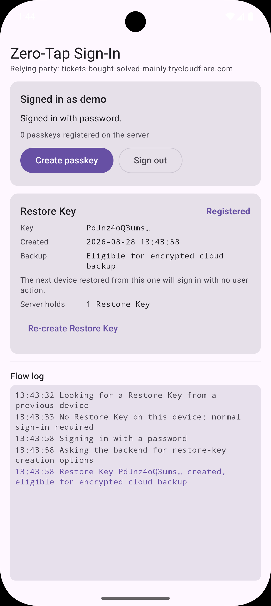

# 実機での移行をテストする

*[English](device-migration-test.md) | 日本語*

処理の検証にあたっては、手軽である [device-to-device-backup-test.ja.md](device-to-device-backup-test.ja.md) を先に実行すべきです。

## Emulator テストでは確かめられないこと

- **実際の暗号化バックアップ構成で検証できる**
  - 端末の実際の Google アカウント、バックアップ設定、画面ロックに依存
- **`BackupAgent.onRestoreFinished()` が実際のタイミングで発火する**
  — セットアップ中に呼ばれる、つまりデータが復元されるので、アプリは初めて開いた時点ですでにサインイン済みになる
  - 実際のフローでは復元処理のラグがある

## 前提

- 端末
  - Android 9 以降、Google Play services 24220000 以降の実機2台 (エミュレータ不可)
  - 端末 A
    - Google アカウント、**設定 → Google → バックアップ → オン**、画面ロックをON
    - アプリをインストール
    - WiFi に接続
  - 端末 B
    - 新品または初期化直後
- サービスの準備
  - バックエンドを https でホストすること
  - アプリを該当ホストでビルドすること (e.g. `-Pzerotap.rpId`)
- ケーブル移行用のケーブル

## 手順

**端末 A**

1. アプリでサインインする
2. 次の状態であることを確認
  - **Restore Key** が `Registered`
  - バックアップ行が `This device only` ではなく `Eligible for encrypted cloud backup`
    - `This device only` のまま -> 設定を確認して **Re-create Restore Key** をタップ

   

3. **設定 → Google → バックアップ → 今すぐバックアップ** をタップ

**端末 B**

4. 端末の電源を入れ、セットアップ ウィザードをアプリとデータのコピー手順まで進める
5. **ケーブル**または**クラウド**で端末 A からコピー
  - どちらでもRestore Keyは移行される
  - クラウドバックアップがない場合(ローカル限定の場合)はケーブル必須
6. セットアップを完了し、アプリをインストール
  - アプリがなくともバックアップデータが先に転送されることはある
7. アプリを開く

## 成功

- アプリは初回からサインイン済みの画面で開く
- 引き換えたキーを示す **Signed in with zero taps**バナーと、置き換え後のキーを示す**Restore Key**カードが表示される
- 生体認証のプロンプトもクレデンシャルの選択画面は出ない(Passkeyとの違い)


## 失敗

- エラー表示ではなく、サインイン画面になる (検証アプリの場合)
  - Restore Key に関するエラーはアプリ実装依存

**トラブルシュート**

| 症状 | 考えられる原因 |
| --- | --- |
| 端末 B がサインインを求め、`No Restore Key on this device` とログに出る | 手順 2 の完了前にバックアップが走った。または端末 A のキーがローカル限定なのにクラウド経由を選んだ (ローカル限定のキーはケーブル移行のみ対応)。 |
| 端末 B にアプリはあるがデータが何もない | 復元が終わっていない。アプリ データはアプリのインストールから数分遅れて届くことがあります。 |
| バックエンド: `unknown Restore Key` | 再発行済み。使い捨てなので、同じイメージから復元した 2 台目は再利用不可。あるいはバックエンドが別の `DB_PATH` を見ている。 |
| バックエンド: `Restore Key verification failed` | オリジンの不一致。バックエンド起動時の `origins=` 行と、失敗時の `apk-key-hash` を比べる。端末 B が別の鍵で署名された APK を動かしているケース。 |
| バックエンドに何も届かない | `RP_ID`、`zerotap.rpId` を確認すること |

## さらに次へ移行するケース

- 端末 B はサインインが完了した時点で新しい Restore Key になっているので、そのまま端末 A(初期化後) or Cに移行が可能
- 端末 A にあるキーは失効している
  - バックエンドの実装次第。セキュリティ的には失効が妥当に思われる
  - 同じ端末からの複数台移行については自アプリだけではなく他アプリも関連するため、特段配慮する必要はなし

### ログについて

- バックアップエージェントは別プロセスで動き、ログもそのプロセス内のメモリ上にある
- アプリを起動したとて、そのプロセスのログには出ない

**成功の場合**

backupAgent の名前を使うと閲覧可

```console
$ adb logcat -d -s ZeroTapBackupAgent
I ZeroTapBackupAgent: Restore finished; signed in as jmatsu
```

バックエンドのログには対応する 2 行が出る

```
level=INFO msg="zero-tap sign-in" user=jmatsu revokedCredential=AbCdEf123456...
level=INFO msg="Restore Key registered" user=jmatsu credential=NewKey7890...
```
